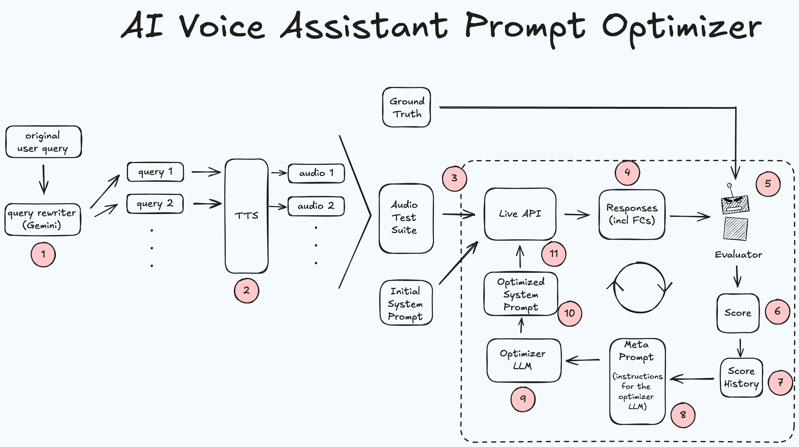

# AI Voice Assistant Prompt Optimizer

A demonstration of **Automatic Prompt Engineering (APE)** that iteratively improves system prompts for voice assistants with function calling capabilities.

## 🎯 What This Demonstrates

This project showcases how AI can automatically optimize AI system prompts by:
1. **Generating diverse test cases** from simple input queries using AI-powered query restatement
2. **Creating realistic audio test suites** for voice assistant evaluation
3. **Running iterative optimization** using a metaprompt that learns from previous attempts
4. **Evaluating function calling accuracy** across diverse scenarios and speaking styles
5. **Providing detailed analytics** with early stopping when performance targets are met

## 🏗️ Architecture Overview



The optimization process follows a systematic approach that corresponds to the numbers in the diagram:
1.  **Query Rewriter**: Generates diverse query variations from an original user query.
2.  **Text-to-Speech (TTS)**: Converts text queries into a realistic **Audio Test Suite**.
3.  **Live API Testing**: The audio suite is tested against the live API using the current system prompt.
4.  **Response Capture**: The API's responses, including function calls (FCs), are captured.
5.  **Evaluation**: An evaluator compares the API responses to the "Ground Truth."
6.  **Scoring**: The evaluator assigns a performance score.
7.  **Score History**: The score is logged to track performance over time.
8.  **Meta Prompt**: A prompt with instructions for the optimizer is created based on the score history.
9.  **Optimizer LLM**: A new, improved system prompt is generated by an LLM.
10. **Optimization Loop**: The core iterative cycle where the system improves.
11. **System Prompt Update**: The optimized prompt is fed back into the live API for the next testing round.

This loop repeats until a target accuracy is reached, progressively improving the prompt.

## 🎬 Demo Scenario

The demo uses a generic **virtual assistant** that can:
- **Answer general questions** using the `get_information` function
- **Escalate to human support** using the `escalate_to_support` function for:
  - Direct requests for human help (`human-request`)
  - Users in distress or vulnerable situations (`vulnerable-user`)

**Starting Point**: A comprehensive initial prompt with baseline accuracy
**Goal**: Automatically improve to 90%+ accuracy through iterative optimization

## 📁 Project Structure

```
voice-assistant-prompt-optimization/
├── 01_prepare_test_suite.py     # Step 1: Generate test cases and audio
├── 02_run_optimization.py       # Step 2: Run prompt optimization
├── initial-system-instruction.txt  # Comprehensive starting prompt
├── optimization.log             # Detailed optimization logs (auto-generated)
├── test_preparation.log         # Test suite preparation logs (auto-generated)
├── audio_test_suite/           # Generated audio files and mappings
├── configs/
│   ├── input_queries.json      # Base queries for test generation
│   └── model_configs.py        # AI model configurations
├── data_generation/
│   ├── audio_generator.py      # Text-to-speech generation
│   ├── query_restater.py       # Query variation generation
│   └── output_queries.json     # Generated query variations (auto-generated)
├── evaluation/
│   └── audio_fc_evaluator.py   # Function call evaluation system
├── optimization/
│   ├── metaprompt_template.txt # Template for prompt optimization
│   └── prompt_optimizer.py     # Core optimization engine
├── runs/                       # Optimization results (auto-generated)
└── requirements.txt            # Python dependencies
```

## 🚀 Quick Start

### Prerequisites

1. **Google Cloud Account** with Vertex AI enabled
2. **Python 3.8+**
3. **Audio processing capabilities** (for TTS generation)

### 1. Environment Setup

```bash
# Clone the repository
git clone <your-repo-url>
cd voice-assistant-prompt-optimization

# Install dependencies
pip install -r requirements.txt

# Set up Google Cloud authentication
gcloud auth application-default login

# Set environment variables
export GOOGLE_CLOUD_PROJECT="your-project-id"
export GOOGLE_CLOUD_LOCATION="us-central1"  # or your preferred region
```

### 2. Generate Test Suite

```bash
python 01_prepare_test_suite.py
```

This script will:
- Load base queries from `configs/input_queries.json`
- Generate multiple variations of each query using AI
- Create audio files using text-to-speech with different voices and accents
- Build a comprehensive test mapping file
- Generate logs in `test_preparation.log`

**Expected output**: `audio_test_suite/` directory with audio files and `audio_mapping.json`

### 3. Run Optimization

```bash
python 02_run_optimization.py
```

This will:
- Load the comprehensive starting prompt from `initial-system-instruction.txt`
- Iteratively generate improved prompts using APE
- Evaluate each prompt against the audio test suite
- Save detailed results in timestamped `runs/` folders
- Generate logs in `optimization.log`
- Stop early if accuracy threshold is exceeded

## ⚙️ Configuration

### Key Configuration Files

#### `initial-system-instruction.txt`
The comprehensive starting prompt that defines the assistant's behavior:
```
# Identity
You are a helpful AI voice assistant.
Your goal is to help users by answering questions and performing actions through function calls.
Your responses should be 2-3 short sentences. After providing assistance, ask if the user needs anything else.

# User Context
- User's preferred language: en
- Interaction mode: voice

# Responsibilities
Your main job is to understand the user's intent and route their request to the correct function.
...
```

#### `configs/input_queries.json`
Define the base queries for test generation:
```json
{
  "queries": [
    {
      "query": "What's the weather like today?",
      "trigger_function": true,
      "function_name": "get_information",
      "function_args": {"query": "What's the weather like today?"}
    },
    {
      "query": "I need to speak to a human please",
      "trigger_function": true,
      "function_name": "escalate_to_support",
      "function_args": {"reason": "human-request"}
    }
  ]
}
```

#### `configs/model_configs.py`
Configure AI models for different tasks:
```python
# Model for generating query restatements
RESTATE_QUERIES_MODEL = "gemini-2.5-flash"

# Model for generating prompt variations
PROMPT_GENERATION_MODEL = "gemini-2.5-pro"

# Model for evaluating function calls
TARGET_MODEL_FOR_EVAL = "gemini-live-2.5-flash"
```

#### `02_run_optimization.py` - Main Settings
Key parameters you can adjust:
```python
num_iterations = 10             # Number of optimization rounds
max_concurrent_tests = 6        # Parallel evaluation limit
early_stopping_threshold = 1.0  # Stop when accuracy exceeds this (0.0-1.0)
```

### Starting Prompt Customization

Edit the `initial-system-instruction.txt` file to customize the starting prompt:
```
# Identity
You are a helpful AI voice assistant.
Your goal is to help users by answering questions and performing actions through function calls.

# Responsibilities
Your main job is to understand the user's intent and route their request to the correct function.
- For general questions about topics, information requests, or knowledge queries, use the `get_information` function.
- If the user explicitly asks to speak to a human, get help from a person, or requests human assistance, use the `escalate_to_support` function with the reason 'human-request'.
- If the user sounds distressed, anxious, mentions feeling overwhelmed, or describes a difficult situation, use the `escalate_to_support` function with the reason 'vulnerable-user'.
```

## 📊 Understanding Results

### Output Structure

Each optimization run creates a timestamped folder in `runs/`:
```
runs/optimization_20241201_143022/
├── best_prompt.txt              # Final optimized prompt
├── best_prompt_info.json        # Metadata about best prompt
├── prompt_history.txt           # All prompts tried with scores
├── score_history_summary.txt    # Score progression summary
├── iteration_0/                 # Baseline evaluation
│   ├── evaluation_details.json
│   ├── prompt.txt
│   └── summary.json
├── iteration_1/                 # First optimization attempt
└── ...
```

### Key Metrics

- **Overall Accuracy**: Percentage of test cases where function calls matched expected results
- **Query Performance**: Breakdown by query type showing which areas need improvement
- **Critical Failures**: Specific examples of failing cases for debugging

### Early Stopping

The system will automatically stop when:
- The accuracy threshold is reached (default 100%)
- Maximum iterations are completed
- Critical errors prevent continuation

Example early stopping log:
```
🚀 EARLY STOPPING TRIGGERED!
Accuracy threshold 100.0% reached: 96.7%
Stopping optimization at iteration 1
```

### Log Files

The system generates detailed logs:
- **`optimization.log`**: Complete optimization process logs
- **`test_preparation.log`**: Test suite generation logs

## 🔧 Advanced Usage

### Custom Function Schema

To adapt for different function calling scenarios, modify the system prompt in `initial-system-instruction.txt` to include your functions:

```
# Function Selection Guidelines
- **Default to information:** When in doubt about general questions, use `get_information`
- **Clear human requests:** Only use `escalate_to_support` with 'human-request' when explicitly asked
- **Emotional distress:** Use `escalate_to_support` with 'vulnerable-user' when users express anxiety, stress, or emotional difficulty
```

### Extending Test Cases

Add new base queries to `configs/input_queries.json`:
```json
{
  "query": "Your new test query",
  "trigger_function": true,
  "function_name": "your_function_name",
  "function_args": {"param": "value"}
}
```

### Model Configuration

Update `configs/model_configs.py` to use different models:
```python
# Use different models for different stages
RESTATE_QUERIES_MODEL = "gemini-2.5-flash"      # Fast model for query generation
PROMPT_GENERATION_MODEL = "gemini-2.5-pro"      # Advanced model for prompt optimization
TARGET_MODEL_FOR_EVAL = "gemini-live-2.5-flash" # Real-time model for evaluation
```

## 🔍 Troubleshooting

### Common Issues

1. **Missing test suite**: Run `01_prepare_test_suite.py` first
2. **Authentication errors**: Run `gcloud auth application-default login`
3. **Environment variables**: Ensure `GOOGLE_CLOUD_PROJECT` and `GOOGLE_CLOUD_LOCATION` are set
4. **API permissions**: Enable Vertex AI and Text-to-Speech APIs in Google Cloud Console

### Performance Tips

- **Increase concurrent tests** for faster evaluation (adjust `max_concurrent_tests`)
- **Reduce iterations** for quicker testing (adjust `num_iterations`)
- **Lower early stopping threshold** for faster convergence (adjust `early_stopping_threshold`)

## 📈 Results Analysis

The system typically achieves:
- **Starting accuracy**: 60-70% (baseline)
- **Target accuracy**: 90%+ (optimized)
- **Optimization time**: 15-30 minutes (depending on configuration)
- **Test coverage**: 60+ audio variations across multiple query types

Check `runs/` directory for detailed results and analysis.

## 📚 Technical Documentation

For comprehensive technical details, implementation specifics, and advanced usage:

📖 **[TECHNICAL.md](TECHNICAL.md)** - Complete technical documentation including:
- Detailed architecture and implementation specifics
- Audio processing pipeline details  
- Optimization engine internals
- Standalone testing and debugging modes
- Advanced configuration examples
- File format specifications
- Development and contributing guidelines

## 📄 License

This project is licensed under the MIT License - see the LICENSE file for details.

## ⚠️ Disclaimer

This is a personal project by Heiko Hotz to explore Gemini Live API prompt optimisation.

**This project is developed independently and does not reflect the views or efforts of Google.**
